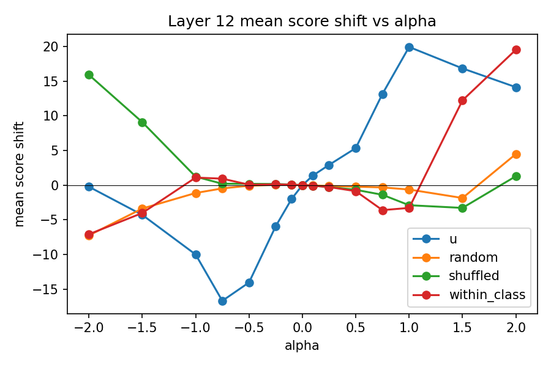
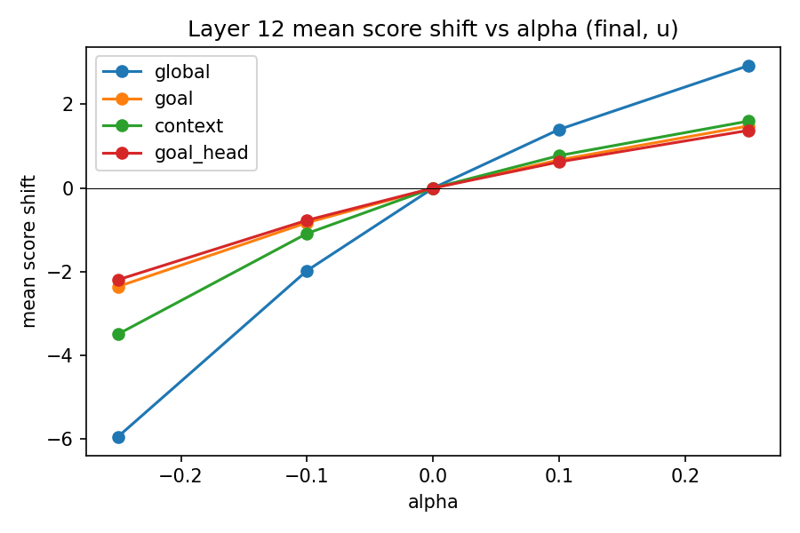
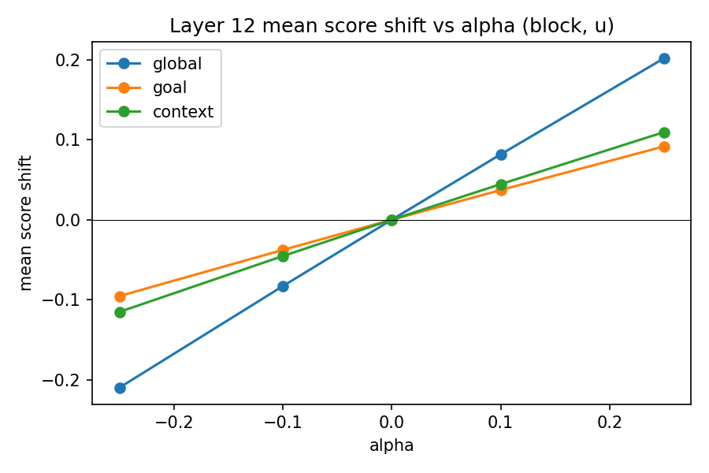

This repo contains a minimal pipeline to probe and steer a Lean tactic generator (ByT5) on the binary behavior `intro` vs `apply` using teacher-forced scoring, layerwise probes, and a simple activation addition intervention.

Writeup

- See `WRITEUP.md` for a short report with key results and figures.

Quick Reproduce (CPU)

```bash
bash scripts/quick_reproduce.sh
```

Expect a few hours on CPU. The script builds a balanced 5k dataset, computes directions, runs the control sweep and token-localized sweep on test500, and runs a lightweight in-encoder RMS-scaled sweep on test200.

Repro status: Last reproduced from scratch on commit `ac1395e` (working tree) with `scripts/quick_reproduce.sh`.

Key Figures





Quickstart

1) Create a venv and install deps:

```bash
python -m venv .venv
. .venv/bin/activate
pip install --no-cache-dir torch --index-url https://download.pytorch.org/whl/cpu
pip install --no-cache-dir -r requirements.txt
```

2) Download the ReProver Benchmark 4 data, then extract a labeled JSONL:

```bash
python external/ReProver/scripts/download_data.py --data-path data

python scripts/extract_intro_apply.py \
  --input /path/to/leandojo_benchmark_4 \
  --output data/intro_apply.jsonl \
  --max-total 5000 \
  --balance \
  --max-state-chars 2000
```

2b) (Optional but recommended) Make a fixed train/test split and compute directions:

```bash
python scripts/split_intro_apply.py \
  --input data/intro_apply.jsonl \
  --train-output data/intro_apply_train.jsonl \
  --test-output data/intro_apply_test.jsonl \
  --train-size 4000 \
  --test-size 1000 \
  --balance \
  --seed 42

python scripts/compute_directions.py \
  --train data/intro_apply_train.jsonl \
  --output-dir data/directions \
  --layers 11,12 \
  --max-length 384 \
  --batch-size 16 \
  --seed 42
```

3) Compute teacher-forced scores:

```bash
python scripts/score_intro_apply.py \
  --data data/intro_apply.jsonl \
  --output data/scores.jsonl
```

4) Save pooled encoder activations:

```bash
python scripts/save_activations.py \
  --data data/intro_apply.jsonl \
  --output data/activations.pt
```

5) Train layerwise probes and plot accuracy:

```bash
python scripts/train_probes.py \
  --activations data/activations.pt \
  --output data/probe_results.csv \
  --plot data/probe_plot.png
```

6) Run activation addition steering:

```bash
python scripts/steer_activation_addition.py \
  --data data/intro_apply.jsonl \
  --activations data/activations.pt \
  --layer 8 \
  --alphas -5 -2 -1 0 1 2 5 \
  --output data/steer_results.json
```

7) Run a denser alpha sweep with controls (real/random/shuffled/within-class) on test:

```bash
python scripts/steer_sweep.py \
  --test data/intro_apply_test.jsonl \
  --directions data/directions/directions_layer11.pt data/directions/directions_layer12.pt \
  --output data/steer_sweep_test.json \
  --plot-dir data/plots \
  --batch-size 32 \
  --max-length 384 \
  --seed 42
```

8) Token-localized steering (goal vs context):

```bash
python scripts/steer_sweep.py \
  --test data/intro_apply_test.jsonl \
  --directions data/directions/directions_layer11.pt data/directions/directions_layer12.pt \
  --output data/steer_tokenloc_test.json \
  --plot-dir data/plots_tokenloc \
  --batch-size 32 \
  --max-length 384 \
  --alphas -0.25 -0.1 0 0.1 0.25 \
  --mask-modes global,goal,context,goal_head \
  --goal-head-tokens 64 \
  --injection final \
  --seed 42
```

9) In-encoder injection (scaled for RMS norm):

```bash
python scripts/compute_directions.py \
  --train data/intro_apply_train.jsonl \
  --output-dir data/directions_rms \
  --layers 11,12 \
  --max-length 384 \
  --batch-size 16 \
  --seed 42 \
  --apply-rms-norm

python scripts/steer_sweep.py \
  --test data/intro_apply_test.jsonl \
  --directions data/directions_rms/directions_layer11.pt data/directions_rms/directions_layer12.pt \
  --output data/steer_inencoder_test.json \
  --plot-dir data/plots_inencoder \
  --batch-size 16 \
  --max-length 384 \
  --alphas -0.25 -0.1 0 0.1 0.25 \
  --mask-modes global,goal,context \
  --direction-names u \
  --injection block \
  --block-scale rms \
  --seed 42
```

Notes

- Default model is `kaiyuy/leandojo-lean4-tacgen-byt5-small`. Override with `--model`.
- If your dataset schema differs, `extract_intro_apply.py` accepts `--state-key` and `--tactic-key`.
- ByT5 is byte-level; attention and token indices are byte-based.
